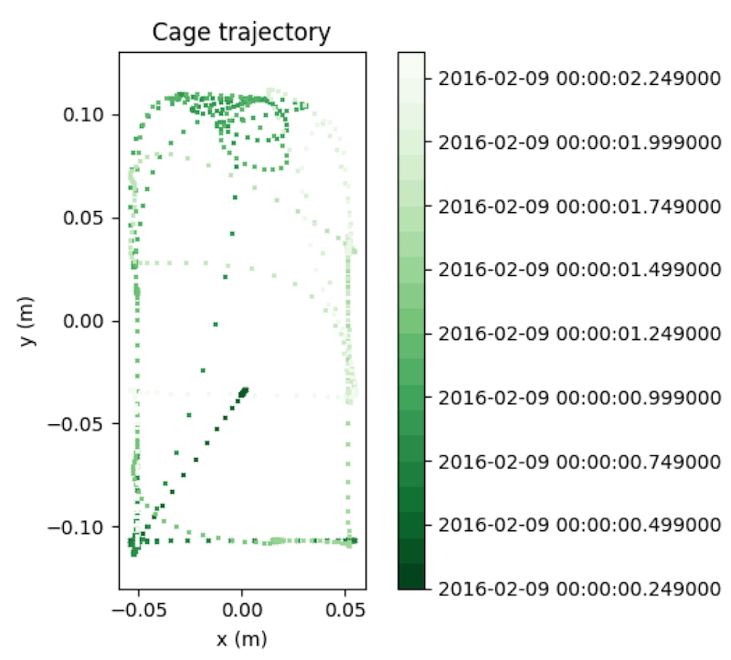

# traja
Trajectory Analysis in Python

## Installation and setup

Install traja onto your system with `pip install traja` # TODO: Add as PyPI package

Import traja into your Python script or via the Python command-line with `import traja`.

## Trajectories with traja

...

## Demo

Coming soon.

Details coming soon.
