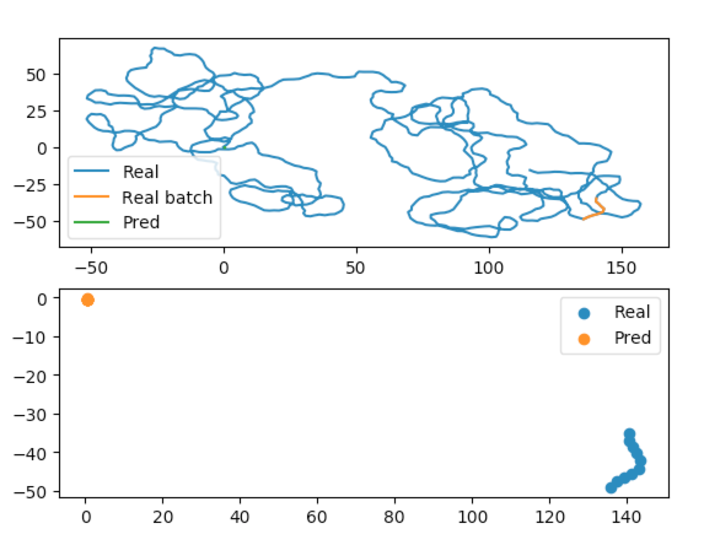

Predicting Trajectories
=======================

Predicting trajectories with traja can be done with a recurrent neural network (RNN). Traja includes
the Long Short Term Memory (LSTM), LSTM Autoencoder (LSTM AE) and LSTM Variational Autoencoder (LSTM VAE)
RNNs. Traja also supports custom RNNs.

To model a trajectory using RNNs, one needs to fit the network to the model. Traja includes the MultiTaskRNNTrainer
that can solve a prediction, classification and regression problem with traja DataFrames.

`Traja` also includes a DataLoader that handles traja dataframes.

Below is an example with a prediction LSTM via :py:class:`traja.models.predictive_models.lstm.LSTM`.

.. code-block:: python

    import traja

    df = traja.dataset.example.jaguar()

.. note::
    LSTMs work better with data between -1 and 1. Therefore the data loader
    scales the data.

.. code-block:: python

    batch_size = 10 # How many sequences to train every step. Constrained by GPU memory.
    num_past = 10 # How many time steps from which to learn the time series
    num_future = 10 # How many time steps to predict
    split_by_id = False # Whether to split data into training, test and validation sets based on
                        # the animal's ID or not. If True, an animal's entire trajectory will only
                        # be used for training, or only for testing and so on.
                        # If your animals are territorial (like Jaguars) and you want to forecast
                        # their trajectories, you want this to be false. If, however, you want to
                        # classify the group membership of an animal, you want this to be true,
                        # so that you can verify that previously unseen animals get assigned to
                        # the correct class.

.. autoclass:: traja.models.predictive_models.lstm.LSTM
    :members:

    dataloaders = traja.dataset.MultiModalDataLoader(df,
                                                batch_size=batch_size,
                                                n_past=num_past,
                                                n_future=num_future,
                                                num_workers=0,
                                                split_by_id=split_by_id)

.. note::

    The width of the hidden layers and depth of the network are the two main ways in which
    one tunes the performance of the network. More complex datasets require wider and deeper
    networks. Below are sensible defaults.

.. code-block:: python

    from traja.models.predictive_models.lstm import LSTM
    input_size = 2 # Number of input dimensions (normally x, y)
    output_size = 2 # Same as input_size when predicting
    num_layers = 2 # Number of LSTM layers. Deeper learns more complex patterns but overfits.
    hidden_size = 32 # Width of layers. Wider learns bigger patterns but overfits. Try 32, 64, 128, 256, 512
    dropout = 0.1 # Ignore some network connections. Improves generalisation.

    model = LSTM(input_size=input_size,
                 hidden_size=hidden_size,
                 num_layers=num_layers,
                 output_size=output_size,
                 dropout=dropout,
                 batch_size=batch_size)

.. code-block:: python

    from traja.models.train import HybridTrainer

    optimizer_type = 'Adam' # Nonlinear optimiser with momentum
    loss_type = 'huber'

    # Trainer
    trainer = HybridTrainer(model=model,
                            optimizer_type=optimizer_type,
                            loss_type=loss_type)
    # Train the model
    trainer.fit(dataloaders, model_save_path='./model.pt', epochs=10, training_mode='forecasting')

After training, you can determine the network's final performance with test data, if you want to pick
the best model, or with validation data, if you want to determine the performance of your model.

The ``dataloaders`` dictionary contains the ``sequential_test_loader`` and ``sequential_validation_loader``,
that preserve the order of the original data. The dictionary also contains the 'test_loader' and
``validation_loader`` data loaders, where the order of the time series is randomised.

.. code-block:: python

    validation_loader = dataloaders['sequential_validation_loader']

    trainer.validate(validation_loader)

Finally, you can display your training results using the built-in plotting libraries.

.. code-block:: python

    from traja.plotting import plot_prediction

    batch_index = 0  # The batch you want to plot
    plot_prediction(model, validation_loader, batch_index)

Parameter searching
-------------------

When optimising neural networks, you often want to change the parameters. When training a forecaster,
you have to reinitialise and retrain your model. However, when training a classifier or regressor, you
can reset these on the fly, since they work directly on the latent space of your model.
VAE models provide utility functions to make this easy.

.. code-block:: python

    from traja.models import MultiModelVAE
    input_size = 2 # Number of input dimensions (normally x, y)
    output_size = 2 # Same as input_size when predicting
    num_layers = 2 # Number of LSTM layers. Deeper learns more complex patterns but overfits.
    hidden_size = 32 # Width of layers. Wider learns bigger patterns but overfits. Try 32, 64, 128, 256, 512
    dropout = 0.1 # Ignore some network connections. Improves generalisation.

    # Classifier parameters
    classifier_hidden_size = 32
    num_classifier_layers = 4
    num_classes = 42

    # Regressor parameters
    regressor_hidden_size = 18
    num_regressor_layers = 1
    num_regressor_parameters = 3

    model = MultiModelVAE(input_size=input_size,
                          hidden_size=hidden_size,
                          num_layers=num_layers,
                          output_size=output_size,
                          dropout=dropout,
                          batch_size=batch_size,
                          num_future=num_future,
                          classifier_hidden_size=classifier_hidden_size,
                          num_classifier_layers=num_classifier_layers,
                          num_classes=num_classes,
                          regressor_hidden_size=regressor_hidden_size,
                          num_regressor_layers=num_regressor_layers,
                          num_regressor_parameters=num_regressor_parameters)

    new_classifier_hidden_size = 64
    new_num_classifier_layers = 2

    model.reset_classifier(classifier_hidden_size=new_classifier_hidden_size,
                           num_classifier_layers=new_num_classifier_layers)

    new_regressor_hidden_size = 64
    new_num_regressor_layers = 2
    model.reset_regressor(regressor_hidden_size=new_regressor_hidden_size,
                          num_regressor_layers=new_num_regressor_layers)