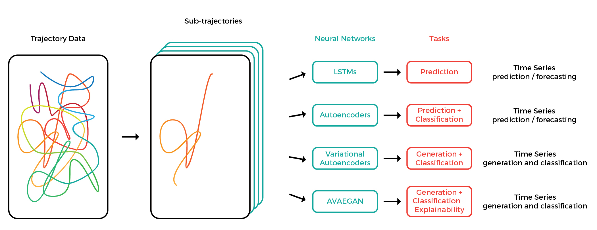

# Summary
There are generally four categories of trajectory data: mobility of people, mobility of transportation vehicles, mobility of animals, and mobility of natural phenomena [@zheng-trajectory-2015]. Animal tracking is important for fields as diverse as ethology, optimal foraging theory, and neuroscience. Mouse behavior, for example, is a widely studied in biomedical and brain research in models of neurological disease such as stroke.[^1] 

Several tools exist which allow analyzing mouse locomotion. Tools such as Ethovision [@spink_ethovision_2001] and DeepLabCut [@Mathisetal2018] allow converting video data to pose coordinates, which can further be analyzed by other open source tools. DLCAnalyzer[^2] provides a collection of R scripts for analyzing positional data, in particular visualizing, classifying and plotting movement. B-SOiD [@Hsu770271] allows unsupervised clustering of behaviors, extracted from the pose coordinate outputs of DeepLabCut. SimBA [@sgoldenlab_2021_4521178] provides several classifiers and tools for behavioral analysis in video streams in a Windows-based graphical user interface (GUI) application.

These tools are primarily useful for video data, which is not available for the majority of animal studies. For example, video monitoring of home cage mouse data is impractical today due to housing space constraints. Researchers using Python working with non-visual animal tracking data sources are not able to fully leverage these tools. Thus, a tool that supports modeling in the language of state-of-the-art predictive models  [@amirian_social_2019; @liang_peeking_2019; @chandra_traphic_2019], and which provides animal researchers with a high-level API for multivariate time series feature extraction, modeling and visualization is needed.

Traja is a Python package for statistical analysis and computational modelling of trajectories. Traja extends the familiar pandas [@mckinney-proc-scipy-2010; @reback2020pandas] methods by providing a pandas accessor to the `df.traja` namespace upon import. The API for Traja was designed to provide an object-oriented and user-friendly interface to common methods in analysis and visualization of animal trajectories. Traja also interfaces well with relevant spatial analysis packages in R (e.g., trajr [@mclean_trajr:_2018] and adehabitat [@adehabitat]), Shapely [@shapely], and MovingPandas [@graser_movingpandas_2019] allowing rapid prototyping and comparison of relevant methods in Python. A comprehensive source of documentation is provided on the home page
([http://traja.readthedocs.io](traja.readthedocs.io)).

## Statement of Need
The data used in this project includes animal trajectory data provided by [http://www.tecniplast.it](Tecniplast S.p.A.), manufacturer of laboratory animal equipment based in Varese, Italy, and Radboud University, Nijmegen, Netherlands. Tecniplast provided the mouse locomotion data collected with their Digital Ventilated Cages (DVC). The extracted coordinates of the mice requires further analysis with external tools. Due to lack of access to equipment, mouse home cage data is rather difficult to collect and analyze, thus few studies have been done on home cage data. Furthermore, researchers who are interested in developing novel algorithms must implement from scratch much of the computational and algorithmic infrastructure for analysis and visualization. By packaging a library that is particularly useful for animal locomotion analysis, future researchers can benefit from access to a high-level interface and clearly documented methods for their work.

Other toolkits for animal behavioral analysis either rely on visual data [@Mathisetal2018; @vivek_hari_sridhar_2017_1134016] to estimate the pose of animals or are limited to the R programming language [@mclean_trajr:_2018]. Prototyping analytical approaches and exploratory data analysis is furthered by access to a wide range of methods which existing libraries do not provide. Python is the *de facto* language for machine learning and data science programming, thus a toolkit in Python which provides methods for prototyping multivariate time series data analysis and deep neural network modeling is needed.

## Overview of the Library
Traja targets Python because of its popularity with data scientists. The library leverages the powerful pandas library [@mckinney-proc-scipy-2010], while adding methods specifically for trajectory analysis. When importing Traja, the Traja namespace registers itself within the pandas dataframe namespace via `df.traja`.

The software is structured into three parts. These provide functionality to transform, analyse and visualize trajectories. Full details are available at <https://traja.readthedocs.io/>.  The `trajectory` module provides analytical and preprocessing functionalities. The `models` subpackage provides both traditional and neural network-based tools to determine trajectory properties. The `plotting` module allows visualizing trajectories in various ways. 

Data, e.g., x and y coordinates, are stored as one-dimensional labelled arrays as instances of the pandas native `Series` class. Further, subclassing the pandas `DataFrame` allows providing an API that mirrors the pandas API which is familiar to most data scientists, thus reducing the barrier for entry while providing methods and properties specific to trajectories for rapid prototyping.
Traja depends on Matplotlib [@Hunter:2007] and Seaborn [@Waskom2021] for plotting and NumPy [@harris2020array] for computation.

### Trajectory Data Sources
Trajectory data as time series can be extracted from a wide range of sources, including video processing tools as described above, GPS sensors for large animals or via home cage floor sensors, as described in the section below. The methods presented here are implemented for orthogonal coordinates *(x, y)* primarily to track animal centroids, however with some modification they could be extended to work in 3-dimensions and with body part locations as inputs. Traja is thus positioned at the end of the data scientist's chain of tools with the hope of supporting prototyping novel data processing approaches. A sample dataset of jaguar movement [@morato_jaguar_2018] is provided in the `traja.dataset` subpackage.

## Mouse Locomotion Data
The data samples presented here[^3] are in 2-dimensional location coordinates, reflecting the mouse home cage (25x12.5 cm) dimensions. Analytical methods relevant to 2D rectilinear analysis of highly constrained spatial coordinates are thus primarily considered.

High volume data like animal trajectories has an increased tendency to have missing data due to data collection issues or noise. Filling in the missing data values, referred to as _data imputation_, is achieved with a wide variety of statistical or learning-based methods. As previously observed, data science projects typically require at least _95%_ of the time to be spent on cleaning, pre-processing and managing the data [@bosch_engineering_2021]. Therefore, several methods relevant to preprocessing animal data are demonstrated throughout the following sections.

[^1]: The examples in this paper focus on animal motion, however it is useful for other domains. 

[^2]: <https://github.com/ETHZ-INS/DLCAnalyzer>

[^3]: This dataset has been collected for other studies of our laboratory [@shenk_automated_2020].

## Spatial Trajectory
A *spatial trajectory* is a trace generated by a moving object in geographical space. Trajectories are traditionally modelled as a sequence of spatial points like:

$$T_k = \{P_{k1}, P_{k2},...\}$$

where $P_{ki}(i\geq 1)$ is a point in the trajectory.

Generating spatial trajectory data via a random walk is possible by sampling from a distribution of angles and step sizes [@kareiva_analyzing_1983; @mclean_trajr:_2018]. A correlated random walk (Figure [1](#fig:generated){reference-type="ref" reference="fig:generated"}) is generated with `traja.generate`.

![Generation of a random walk[]{label="fig:generated"}](./images/generate.png){#fig:generated width=80%}

## Spatial Transformations
Transformation of trajectories can be useful for comparing trajectories from various geospatial coordinates, data compression, or simply for visualization purposes.

### Feature Scaling
Feature scaling is common practice for preprocessing data for machine learning [@grus_data_2015] and is essential for even application of methods to attributes. For example, a high dimensional feature vector $\mathbf{x} \in \mathbb{R}^n$ where some attributes are in $(0,100)$ and others are in $(-1,1)$ would lead to biases in the treatment of certain attributes. To limit the dynamic range for multiple data instances simultaneously, scaling is applied to a feature matrix $X = \{\mathbf{x_1}, \mathbf{x_2}, ..., \mathbf{x_N}\} \in \mathbb{R}^{n\times{N}}$, where $n$ is the number of instances.

**Min-Max Scaling** To guarantee that the algorithm applies equally to all attributes, the normalized feature matrix $\hat{X}$ is rescaled into range $(0,1)$ such that

$\hat{X} = \frac{X - X_{min}}{X_{max} - X_{min}}$.

**Standardization** The result of standardization is that the features will be rescaled to have the property of a standard normal distribution with $\mu = 0$ and $\sigma = 1$ where $\mu$ is the mean (average) of the data and $\sigma$ is the standard deviation from the mean. Standard scores (also known as **z**-scores are calculated such that

$z = \frac{x-\mu}{\sigma}$.

**Scaling** Scaling a trajectory is implemented for factor $f$ in `scale` where $f \in R: f \in (-\infty, +\infty)$.

### Rotation
Rotation of a 2D rectilinear trajectory is a coordinate transformation of orthonormal bases x and y at angle $\theta$ (in radians) around the origin defined by

$$\begin{bmatrix} x'\\y' \end{bmatrix} = \begin{bmatrix} cos\theta & i sin\theta\\ sin\theta & cos\theta \end{bmatrix} \begin{bmatrix} x\\y \end{bmatrix} $$

with angle $\theta$ where $\theta \in R : \theta \in [-180,180]$.

### Trip Grid
One strategy for compressing the representation of trajectories is binning the coordinates to produce an image as shown in Figure [2](#fig:tripgridalgo){reference-type="ref" reference="fig:tripgridalgo"}.

{#fig:tripgridalgo width=100%}

Allowing computation on discrete variables rather than continuous ones has several advantages stemming from the ability to store trajectories in a more memory efficient form.[^4] The advantage is that computation is generally faster, more data can fit in memory in the case of complex models, and item noise can be reduced.

[^4]: In this experiment, for example, data can be reduced from single-precision floating point (32 bits) to 8-bit unsigned integer (*uint8*) format.

Creation of an $M * N$ grid allows mapping trajectory $T_k$ onto uniform
grid cells. Generalizing the nomenclature of [@wang_modeling_2017] to rectangular grids, $C_{mn}(1\leq{m}\leq M; 1\leq{n}\leq{N})$ denotes the cell in row $m$ and column $n$ of the grid. Each point $P_{ki}$ is assigned to a cell $C(m,n)$. The result is a two-dimensional image $M*N$ image $I_k$, where the value of pixel $I_k(m,n)(1\leq{m,n}\leq{M})$ indicates the relative number of points assigned to cell $C_{mn}$. Partionining of spatial position into separate grid cells is often followed by generation of hidden Markov models [@jeung_mining_2007] (see below) or visualization of heat maps (Figure [3](#fig:heatmap){reference-type="ref" reference="fig:heatmap"}).

![Visualization of heat map from bins generated with `df.trip_grid`. Note regularly spaced artifacts (bright yellow) in this sample due to a bias in the sensor data interpolation. This type of noise can be minimized by thresholding or using a logarithmic scale, as shown above.[]{label="fig:heatmap"}](./images/tripgrid.png){#fig:heatmap width=50%}

### Smoothing
Smoothing a trajectory can also be achieved with Traja using Savitzky-Golay filtering with `smooth_sg` [@savitzky_smoothing_1964].

## Resampling and Rediscretizing
Trajectories can be resampled by time or rediscretized by an arbitrary step length. This can be useful for aligning trajectories from various data sources and sampling rates or reducing the number of data points to improve computational efficiency. Care must be taken to select a time interval which maintains information on the significant behavior. If the minimal time interval observed is selected for the points, calculations will be computationally intractable for some systems. If too large of an interval is selected, we will fail to capture changes relevant to the target behavior in the data.

Resampling by time is performed with `resample_time` (Figure [4](#fig:sample){reference-type="ref" reference="fig:sample"}). Rediscretizing by step length is performed with `rediscretize`.

![Resampling trajectories by different time scales is performed with `resample_time`.[]{label="fig:sample"}](./images/sample_rate.png){#fig:step width=80%}

For example, the Fortasyn dataset [@shenk_automated_2020] demonstrated in this paper was sampled at 4 Hz and converted to single-precision floating point data. Pandas dataframes store this data in 4 bytes, thus there are approximately 4.15 MB[^5] bytes required to store data for x and y dimensions plus an index reference for a single day. In the case of [@shenk_automated_2020], 24 mice were observed over 35 days. This translates to 3.4 GB ($10^9$) of storage capacity for the uncompressed datasets prior to feature engineering. Thus resampling can be a useful way to reduce the memory footprint for memory constrained processes that have to fit into a standard laptop with 8 GB memory space. A demonstration of how reduction in precision for trajectory data analysis is provided in Figure [4](#fig:step){reference-type="ref" reference="fig:step"}, as applied to a sample from the Fortasyn experiment [@shenk_automated_2020]. Broad effects such as cage crossings, for example, can still be identified while downsampling data to a lower frequency, such as 0.1 Hz, reducing the memory footprint by a factor of 40 (4 Hz/0.1 Hz) and providing significant speedups for processing.

## Movement Analysis
Traja includes traditional as well as advanced methods for trajectory analysis.

### Distance traveled
Distance traveled is a common metric in animal studies - it accounts for the total distance covered by the animal within a given time interval. The distance traveled is typically quantified by summing the square straight-line displacement between discretely sampled trajectories [@rowcliffe_bias_2012; @solla_eliminating_1999]. Alternative distance metrics for the case of animal tracking are discussed in [@noonan_scale-insensitive_2019].

Let $p(t) = [p_x(t), p_y(t)]$ be a $2\times 1$ vector of coordinates on the ground representing the position of the animal at time t. Then, the distance traveled within the time interval $t_1$ and $t_2$ can be computed as a sum of step-wise Euclidean distances

$$p(t_1,t_2) = \Sigma^{t_2}_{t=t_1+1} d(t),$$

where
$$d(t) = \sqrt{(p_x(t) -p_x(t-1))^2 + (p_y(t) - p_y(t-1))^2}  $$

is the Euclidean distance between two positions in adjacent time samples.

[^5]: 4 x 4 Hz x 60 seconds x 60 minutes x 24 hours x 3 features (x, y, and time)

![Velocity histogram from one day of mouse activity.[]{label="fig:velocity-hist"}](./images/velocitylog.png){#fig:velocity-hist width=50%}

### Speed
Speed or velocity is the first derivative of centroids with respect to time. Peak velocity in a home cage environment is perhaps less interesting than a distribution of velocity observations, as in Figure [5](#fig:velocity-hist){reference-type="ref" reference="fig:velocity-hist"}. Additionally, noise can be eliminated from velocity calculations by using a minimal distance moved threshold, as demonstrated in [@shenk_automated_2020]. This allows identifying broad-scale behaviors such as cage crossings.

### Turn Angles
Turn angles are the angle between the movement vectors of two consecutive samples. They can be calculated with `calc_turn_angles`.

### Laterality
Laterality is the preference for left or right turning and a *laterality index* is defined as:
$$LI = \frac{RT}{LT + RT} $$

where RT is the number of right turns observed and LT is the number of left turns observed. Turns are counted within a left turn angle $\in$ ($\theta$, 90) and right turn angle $\in(-\theta,-90)$. A turn is considered to have a minimal step length.

## Periodicity
Periodic behaviors are a consequence of the circadian rhythm as well as observing expression of underlying cognitive traits. Some basic implementations of periodic analysis of mouse cage data are presented.

### Autocorrelation
Autocorrelation is the correlation of a signal with a delayed copy of itself as a function of the decay. Basically, it is similarity of observations as a function of the time lag between them.
An example is shown in Figure [6](#fig:autocorrelation){reference-type="ref" reference="fig:autocorrelation"}.

![Autocorrelation of the y-dimension reveals daily (1440 minutes) periodic behavior[]{label="fig:autocorrelation"}](./images/autocorrelation_E1.png){#fig:autocorrelation width=80%}

### Power Spectrum
Power spectrum of a time series signal can be estimated (Figure [7](#fig:powerspectrum){reference-type="ref" reference="fig:powerspectrum"}). This is useful for analyzing signals, for example, the influence of neuromotor noise on delays in hand movement [@van_galen_effects_1990].

![Power Spectral Density. One day of activity reveals fairly smooth power spectral density.[]{label="fig:powerspectrum"}](./images/spectrum.png){#fig:powerspectrum width=70%}

## Algorithms and Statistical Models

### Machine Learning for Time Series Data
Machine learning methods enable researchers to solve tasks computationally without explicit instructions by detecting patterns or relying on inference. Thus they are particularly relevant for data exploration of high volume datasets such as spatial trajectories and other multivariate time series.

### Principal Component Analysis
Principal Component Analysis projects the data into a linear subspace with a minimum loss of information by multiplying the data by the eigenvectors of the covariance matrix.

![PCA of Fortasyn trajectory data. Daily trajectories (day and night)
were binned into 8x8 grids before applying
PCA.[]{label="fig:pca"}](./images/pca_fortasyn-period.png){#fig:pca
width=80%}

This requires converting the trajectory to a trip grid (see Figure [2(#fig:tripgridalgo){reference-type="ref" reference="fig:tripgridalgo"}]) and performing PCA on the grid in 2D (Figure [8](#fig:pca){reference-type="ref" reference="fig:pca"}) or 3D (Figure [9](#fig:3dpca){reference-type="ref" reference="fig:3dpca"}). Structure in the data is visible if light and dark time periods are compared.

![3D PCA of Fortasyn trajectory data. Daily trajectories (day and night)
were binned into 8x8 grids before applying
PCA.[]{label="fig:3dpca"}](./images/pca_fortasyn-period-3d.png){#fig:3dpca
width=80%}

### Clustering
Clustering of trajectories is an extensive topic with applications in geospatial data, vehicle and pedestrian classification, as well as molecular identification. K-means clustering is an iterative unsupervised learning method that assigns a label to data points based on a distance function [@bishop_pattern_2006] (Figure [10](#fig:kmeans){reference-type="ref" reference="fig:3dpca"}).

![K-means clustering on the results of the PCA shown above reveals a high accuracy
of classification, with a few errors. Cluster labels are generated by
the model.[]{label="fig:kmeans"}](./images/kmeans_pca-fortasyn.png){#fig:kmeans
width=80%}

### Hierarchical Agglomerative Clustering
Clustering spatial trajectories has broad applications for behavioral research, including unsupervised phenotyping [@huang_mapping_2020]. For mice, hierarchical agglomerative clustering can also be used to identify similarities between groups, for example periodic activity and location visit frequency [@clustering_mice].

### Gaussian Processes
Gaussian Processes is a non-parametric method which can be used to model spatial trajectories. This method is not currently implemented in Traja
and is thus outside the scope of the current paper, however the interested reader is directed to the excellent text on Gaussian processes by Rasmussen and Williams [@rasmussen_gaussian_2006] for a complete reference and [@cox_gaussian_2012] for an application to spatial trajectories.

## Other Methods

### Fractal Methods
Fractal (i.e. multiscale) methods are useful for analyzing transitions and clustering in trajectories. For example, search trajectories such as eye movement, hand-eye coordination, and foraging can be analyzed by quantifying the spatial distribution or nesting of temporal point processes using spatial Allen Factor analysis [@kerster_spatial_2016; @huette_drawing_2013]. 

Recurrence plots and derivative recurrence factor analysis can be applied to trajectories to identify multiscale temporal processes to study transition or nonlinear parameters in a system, such as postural fluctuation  [@ross_influence_2016] and synchrony [@shockley] in humans and to movement of animals such as ants [@neves_recurrence_2017] and bees [@ayers]. These methods are not yet implemented in Traja, but are planned for a future release.

### Graph Models
A graph is a pair $G = (V, E)$ comprising a set of vertices and a set of connecting edges. A probabilistic graphical model of a spatial occupancy grid can be used to identify probabilities of state transitions between nodes. A basic example is given with hidden Markov models below.

![Transition matrix. Rows and columns are flattened histogram of a grid
20 cells high and 10 cells wide. Spatially adjacent grid cells are
visible at a spacing of -11, -10, -9, 1, 10, and 11 cells from the
diagonal. The intensity of pixels in the diagonal represents relative
likelihood to stay in the same
position.[]{label="fig:transitionmatrix"}](./images/transition_matrix.png){#fig:transitionmatrix
width=60%}

### Hidden Markov Models
Transition probabilities are most commonly modelled with Hidden Markov Models (HMM) because of their ability to capture spatial and temporal dependencies. A recent introduction to these methods is available provided by [@patterson_statistical_2017]. HMMs have successfully been used to analyze movement of caribou [@franke_analysis_2004], fruit flies [@holzmann_hidden_2006], and tuna [@patterson_migration_2018], among others. Trajectories are typically modelled as bivariate time series consisting of step length and turn angle, regularly spaced in time.

Traja implements the rectangular spatial grid version of HMM with transitions.

The probability of transition from each cell to another cell is stored as a probability within the transition matrix. This can visualized as a heatmap and plotted with `plot_transition_matrix` (Figure [11](#fig:transitionmatrix){reference-type="ref" reference="fig:transitionmatrix"}).

### Convex Hull
The convex hull of a subtrajectory is the set $X$ of points in the Euclidean plane that is the smallest convex set to include $X$. For computational efficiency, a geometric k-simplex can be plotted covering the convex hull by converting to a Shapely object and using Shapely’s `convex_hull` method.

### Recurrent Neural Networks
In recent years, deep learning has transformed the field of machine learning. For example, the current state of the art models for a wide range of tasks, including computer vision, speech to text, and pedestrian trajectory prediction, are achieved with deep neural networks. Neural networks are essentially sequences of matrix operations and elementwise function application based on a collection of computing units known as nodes or neurons. These units perform operations, such as matrix multiplication on input features of a dataset, followed by backpropagation of errors, to identify parameters useful for approximating a function.

{width=100%}

Recurrent Neural Networks (RNNs) are a special type of Neural Networks that use
a state $S(t_{i-1})$ from the previous timestep $t_{i-1}$ alongside X($t_i$) as input. They output a prediction $Y(t_i)$ and a new state $S(t_i)$ at every step. Utilising previous states makes RNNs particularly good at analyzing time series like trajectories, since they can process arbitrarily long inputs. They remember information from previous time steps $X(t_{i-k}), ..., X(t_{i-1})$ when processing the current time step $X(t_i)$.

Trajectory prediction lets researchers forecast the location and trajectory of animals [@wijeyakulasuriya_machine_2020]. Where this technique works well, it is also a sign that the trajectory is highly regular and, fundamentally, follows certain rules and patterns. When tracking an animal live, it would also let researchers predict when it will arrive at a particular location, or where it will go, letting them rig cameras and other equipment ahead of time.

A particularly interesting type of RNN is the Long Short Term Memory (LSTM) architecture. Their layers use stacks of units, each with two hidden variables - one that quickly discards old states and one that slowly does so - to consider relevant information from previous time steps. They can thus look at a trajectory and determine a property of the animal – whether it is sick or injured, say – something that is time-consuming and difficult to do by hand. They can also predict future time steps based on past ones, letting researchers estimate where the animal will go next. LSTMs can also classify trajectories, determining whether a trajectory comes from an animal belonging in a specific category. This lets researchers determine how a controlled or semi-controlled variable (e.g., pregnancy) changes the movement pattern of an animal.

Traja implements neural networks by extending the widely used open source machine learning library PyTorch [@pytorch], primarily developed by Facebook AI Research Group. Traja allows framework-agnostic modeling through data loaders designed for time series. In addition, the Traja package comes with several predefined model architectures which can be configured according to the user’s requirements.

Because RNNs work with time series, the trajectories require special handling. The `traja.dataset.MultiModalDataLoader` efficiently groups subsequent samples and into series and splits these series into training and test data. It represents a Python iterable over the dataset and extends the PyTorch `DataLoader` class, with support for

- random, weighted sampling,
- data scaling,
- data shuffling,
- train/validation/test split.

`MultiModalDataLoader` accepts several important configuration parameters and
allows batched sampling of the data. The two constructor arguments `n_past` and
`n_future` specify the number of samples that the network will be shown and the number that the network will have to guess, respectively. `batch_size` is generally in the dozens and is used to regularise the network.

The RNNs also need to be trained - this is done by the high-level `Trainer` class below. It performs nonlinear optimisation with a Stochastic Gradient Descent-like algorithm. The `Trainer` class by default implements the Huber loss function [@huber_robust_1964], also known as smooth $L_1$ loss, which is a loss function commonly used in robust regression:

$$L_{\delta} (a) = \begin{cases}
 \frac{1}{2}{a^2}                   & \text{for } |a| \le \delta, \\
 \delta (|a| - \frac{1}{2}\delta), & \text{otherwise.}
\end{cases}$$

In comparison to mean-squared error loss, Huber loss is less sensitive to outliers in data: it is quadratic for small values of a, and linear for large values. It extends the PyTorch `SmoothL1Loss` class, where the $d$ parameter is set to 1.[^6] A common optimization algorithm is ADAM and is Traja’s default, but several others are provided as well. Although training with only a CPU is possible, a GPU can provide a $40-100x$ speedup [@Arpteg2018SoftwareEC].

[^6]: [https://pytorch.org/docs/stable/generated/torch.nn.SmoothL1Loss.html](https://pytorch.org/docs/stable/generated/torch.nn.SmoothL1Loss.html)

### Recurrent Autoencoder Networks
Traja can also train autoencoders to either predict the future position of a track or classify the track into a number of categories. Autoencoders embed the time series into a time-invariant latent space, allowing representation of each trajectory or sub-trajectory as a vector. A class of well-separated trajectories would then be restricted to a region of the latent space. The technique is similar to Word2vec [@word2vec], where words are converted to a 100+ dimensional vector. In this approach, forecasting and classification are both preceded by training the data in an autoencoder, which learns an efficient representation of the data for further computation of the target function.

Traja allows training a classifier that works directly on the latent space output - since each class of trajectories converges to a distinct region in the latent space, this technique is often superior to classifying the trajectory itself. Traja trains classifiers for both Autoencoder-style and Variational Autoencoder-style RNNs. When investigating whether animal behavior has changed, or whether two experimental categories of animals behave differently, this unstructured data mining can suggest fruitful avenues for investigation.

# References
