l

# Summary

Animal tracking is important for fields as diverse as ethology, optimal 
foraging theory, and neuroscience. In recent years, advances in machine
learning have led to breakthroughs in pattern recognition and data modeling.
A tool that support modeling in the language of state-of-the-art predictive
models [@socialways; @next; @TraPHic] and which provides researchers with a high-level
API for feature extraction, modeling and visualization is needed.

Traja is a Python package for trajectory analysis. Traja extends
the familiar pandas [@pandas] methods by providing a pandas accessor 
to the `df.traja` namespace upon import. 
The API for Traja was designed to provide a object-oriented and
user-friendly interface to common methods in analysis and visualization
of animal trajectories.
Traja also interfaces well with relevant spatial analysis packages in R
(e.g., trajr [@trajr], adehabitat [@adehabitat]) and Shapely [@shapely],
allowing rapid prototyping
and comparison of relevant methods in Python.

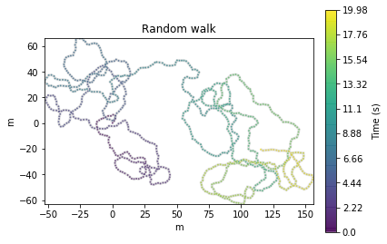

## Spatial Trajectory
 A _spatial trajectory_ is a trace generated by a moving object in geographical spaces. 
 Trajectories are traditionally modelled as a sequence of spatial points like:
 
$$T_k = \{P_{k1}, P_{k2},...\}$$
 
where $P_{ki}(i\geq1)$ is a point in the trajectory.

Advances in location-acquisition technology as well as sensor data has led to an increased interest in trajectory data mining.

#### Constraints.
The dataset under consideration for this thesis are in rectilinear x y Cartesian coordinates $\in \mathbb{R}^2$, thus details and algorithms primarily relevant to GPS coordinates or higher dimensions will be noted only when relevant.
Further, the dataset in question is highly redundant due to the limited range of the home-cage (25 $\times$ 12.5 cm) and the length of the time period (1 month to 8 months).
Analytical methods relevant to 2D rectilinear analysis of highly constrained spatial coordinates are thus primarily considered.

#### Data Collection. 
Animal tracking can be performed using a variety of methods.
The data used in these studies were collected using capacitance sensors observing every 250 ms beneath the home-cage floor and were provided by Tecniplast. 
This method allows minimally disruptive 24/7 tracking of animal activity (operationally defined as change in activation of floor electrodes), distance, and derivative metrics of motion.
Since the activity and centroids were provided, data collection involved preprocessing the raw activity signal and centroid locations to account for null values, to identify missing data, and to group subjects for statistical analysis.

#### Numerical Precision.
Computations in this experiment were performed on single-precision floating point representations of the centroid positions, rather than double-precision, in order to improve computation time.[^1]

#### Data Generation.
Generating spatial trajectory data via a random walk is possible by sampling from a distribution of angles and step sizes\cite{kareiva_analyzing_1983, mclean_trajr:_2018}. A correlated random walk  (\autoref{fig:generated}) is generated with:

traja.generate(n=1000) # 1000 steps

 
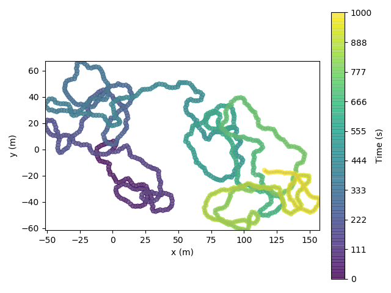
*Generated random walk*

## Geometric Manipulations

### Preprocessing

#### Trip Grid.

One strategy for compressing the representation of trajectories is binning the coordinates to produce an image as show in Figure X.

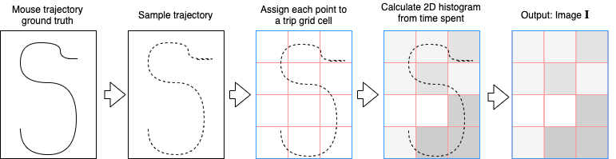
*Trip grid image generation from mouse trajectory.*

Allowing computation on discrete variables rather than continuous ones has several advantages:
 - trajectories are stored in a more memory efficient form[^2].
 - computation is generally faster
 - item noise is reduced

Image based modelling of trajectories is accomplished by 
Heatmaps...

The limits of space-partitioning are described by [@song_mining_2007], which can be overcome by decomposing trajectories of frequently visited regions into subtrajectories. 

Creation of an $M * N$ grid allows mapping trajectory $T_k$ onto uniform grid cells.
Generalizing the nomenclature of [@wang_modeling_nodate] to rectangular grids, $C_{mn}(1\leq{m}\leq M; 1\leq{n}\leq{N})$ denotes the cell in row $m$ and column $n$ of the grid.
Each point $P_{ki}$ is assigned to a cell $C(m,n)$.
The result is a two-dimensional image $M*N$ image $I_k$, where the value of pixel $I_k(m,n)(1\leq{m,n}\leq{M})$ indicates the relative number of points assigned to cell $C_{mn}$.

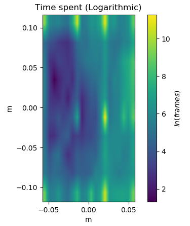
*Note regularly spaced artifacts (bright yellow) due to the sensor data interpolation.
This type of noise can be minimized by thresholding or using a logarithmic scale.*

#### Smoothing.
 Data provided were already smoothed as described in [@iannello_non-intrusive_2019], therefore readers
 are encouraged to read [here] for an overview on trajectory smoothing. Smoothing can also be achieved with traja using Savitzky-Golay filtering, `traja.smooth_sg()`.
 
#### Adjacency Matrix. 
 
#### Resampling.
 Trajectories can be resampled by time or by step length.
 This can be useful for aligning trajectories from various data sources and sampling rates, reducing the number of data points to improve computational efficiency, or ...
 Care must be taken to select a time interval which maintains information on the significant behavior.
 If the minimal time interval observed is selected for the points, calculations will be computationally intractable for some systems. If too large of an interval is selected,
 we will fail to capture changes relevant to the target behavior in the data. 
 
 Resampling by time can be achieved computationally using linear interpolation.
 
 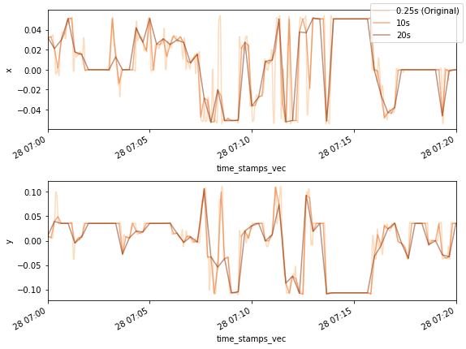
 *Resampling by step length can be achieved with `traja.rediscretize()`.*
 

### Affine Transformations

Transformation of trajectories can be useful for comparing trajectories from various
geospatial coordinates, data compression, or simply for visualization purposes.

__Rotation__

 Rotation of a 2D rectilinear trajectory is a coordinate transformation of
 orthonormal bases x and y at angle $\theta$ around the origin defined by 
 
$$\begin{bmatrix} x' \\ y' \end{bmatrix} =
     \begin{bmatrix} \cos \theta & -\sin \theta \\ \sin \theta & \cos \theta \end{bmatrix} \begin{bmatrix} x \\ y 
    \end{bmatrix}$$
 
 This is achieved with a clockwise angle of 20 degrees, for example, with
 `df.traja.rotate(angle=-20)` and angle $\theta$ where $\theta \in \mathbb{R}: \theta \in [-180,180]$.
 
 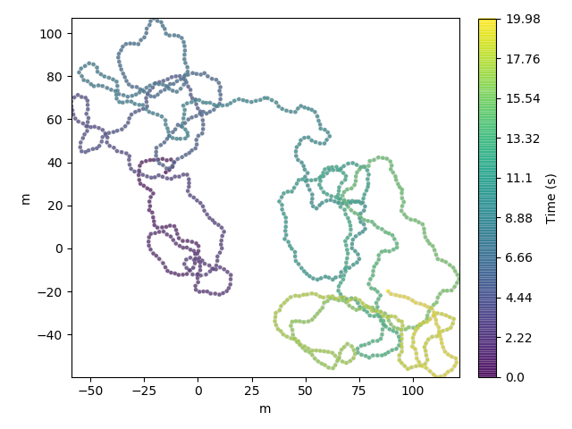    
 
 #### Scale.
 Scaling a trajectory is achieved with `df.traja.scale(factor)` for factor $f$ where $f \in \mathbb{R} : f \in [0,1]$.

### Periodic Analysis
 
 Periodic behaviors are relevant to circadian rhythm as well as observing expression of underlying cognitive traits.
 Some basic implementations of periodic analysis of mouse cage data are presented.
 
#### Autocorrelation.
 Autocorrelation is the ...
 
 It can be computed with `traja.autocorrelation` and plotted with `traja.plot_autocorrelation`, as in Figure X.
 
  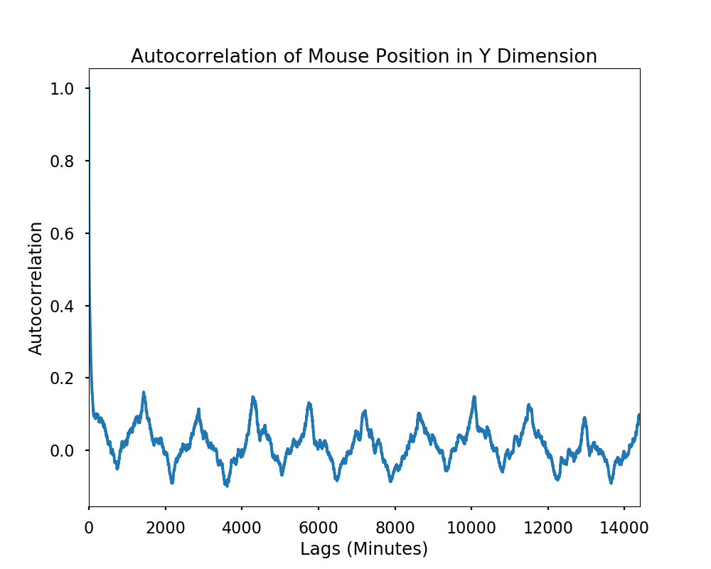
  
 
#### Power Spectrum.
 
 Power spectrum of a time-series signal can be estimated with `traja.plot_periodogram`.

From the spectrum in Figure X, some peaks are observed.
The corresponding frequency to each peak indicates the periodic signals, as well as the strength of this frequency signal.
Higher peaks indicate higher repetition of a signal.  
 
 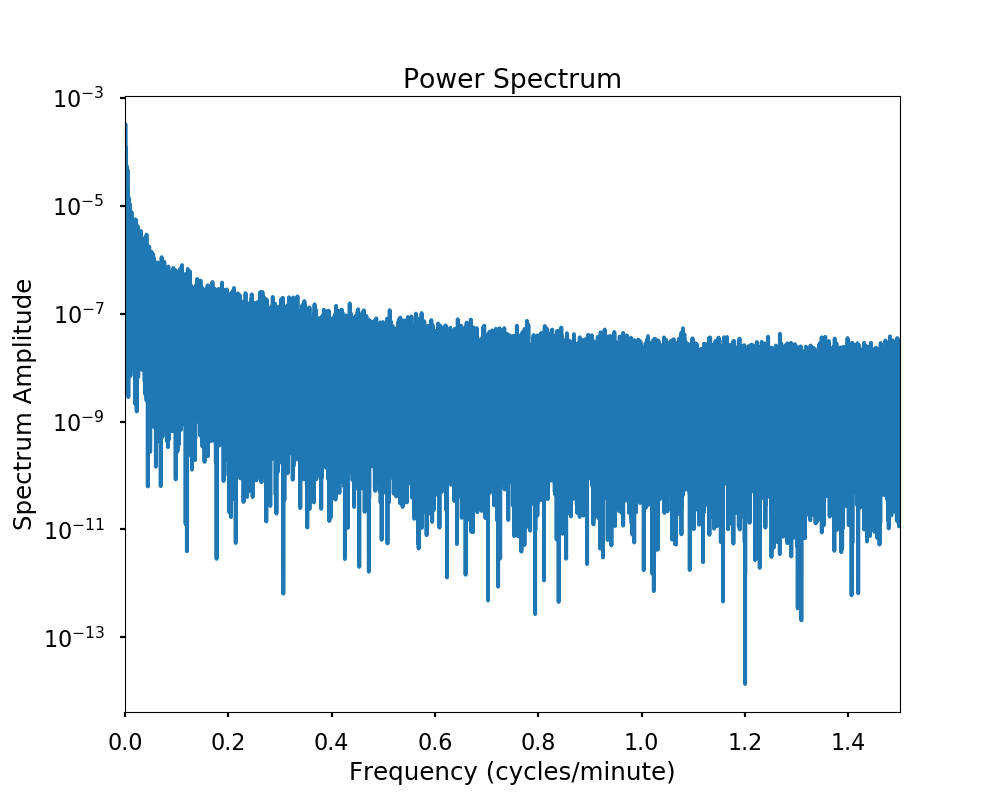
 
### Speed and Linear Acceleration

#### Speed.

Speed or velocity is the first derivative of centroids with respect to time.
Peak velocity in a home cage environment is perhaps less interesting than a distribution of velocity observations, as in Figure X.
Additionally, noise can be eliminated from velocity calculations by using a minimal distance moved threshold, as demonstrated in [Fortasyn paper].
This allows identifying broad-scale behaviors such as cage crossings. 

>>> df.traja.calc_turn_angles()

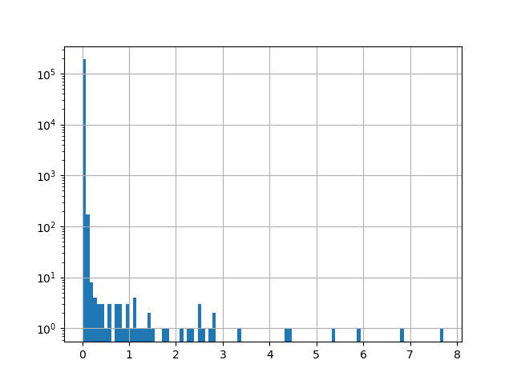
*Velocity histogram from one day.*

#### Turn Angles. 
Turn angles are the angle between the movement vectors of two consecutive samples. They can be calculated with \texttt{trj.traja.calc\_turn\_angles}.

`trj.traja.calc_turn_angles()`

#### Laterality.
_Laterality_ is the preference for left or right turning and a _laterality index_ is defined as: 

$$LI = \frac{RT}{LT + RT}$$

where $RT$ is the number of right turns observed and $LT$ is the number of left turns observed.
Turns are counted within a turn angle range $\in (30, 90)$ for left turns and $\in (-90, -30)$ for right turns. In Traja it is computed with \texttt{trj.traja.calc\_laterality()}:

     x &          y &  time
0.000000 &   0.000000 &  0.00
1.162606 &   1.412179 &  0.02
1.861837 &   2.727244 &  0.04
1.860393 &   4.857967 &  0.06
-0.096486 &   5.802457 &  0.08

## Algorithms and Statistical Models

### Machine Learning
Machine learning methods enable researchers to solve tasks computationally
without explicit instructions by detecting patterns or relying on inference.

__Principal Component Analysis__

Identifying patterns between groups and over time requires finding sufficient
representations of the data for particular methods. One method of reducing the
dimensionality of high dimensional data is to identify the directions which explain
most of the variance via eigendecomposition. 

This requires converting the trajectory to an image (ie, trip grid, see [tripgrid-ref]) and performing principal component analysis on the image in 2D (Figure X) or 3D (Figure X).

Some clusterings in the data are apparent if viewed by light/dark period. 

 *PCA of Fortasyn trajectory data. Daily trajectories (day and
 night) were binned into 8x8 grids before applying PCA.*
 

__Linear Discriminant Analysis__

Linear Discriminant Analysis (LDA) is a method for identifying a manifold separating two or more labelled groups. 
It searches for a linear transformation of the data by maximising the between-class variance and minimising the within-class variance.
It has been used to identify symmetry of heavy object lifting trajectories [@jeong_linear_2016]. 
The advantage of LDA over logistic regression is that is more stable with few examples and well-separated classes than logistic regression.

LDA assumes Gaussian distribution of attributes, and identifies the probability that a new set of inputs belong to a given class.
It provides an identical view to PCA ..[explain] as shown in Figure X.

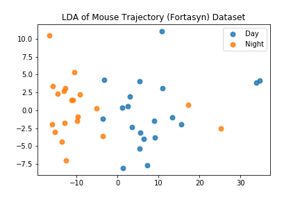
*LDA*

__Clustering__

Clustering of trajectories is an extensive topic with applications in geospatial data, vehicle and pedestrian classification, as well as molecular identification.
Some current methods are reviewed in ...
K-Means clustering is an iterative unsupervised learning method that assigns a label to data points based on a distance function.

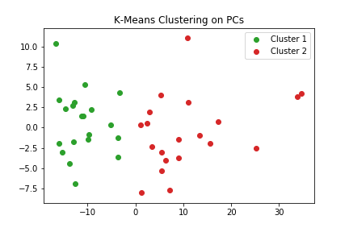
*K-Means clustering on the results of Figure X reveals a high accuracy of classification, with a few errors. Cluster labels are generated by the model.*

__Gaussian Processes__

Gaussian Processes is a non-parametric method which can be used to model 
spatial trajectories [@cox_gaussian_nodate]. 

__Hidden Markov-Models__

Transition probabilities are most commonly modelled with Hidden Markov Models
(HMM) because of their ability to capture spatial and temporal dependencies.
A recent introduction to methods is available at [@patterson_statistical_2017-1].
HMMs have successfully been used to analyze movement of caribou [@franke_analysis_2004], fruit flies[@holzmann_hidden_2006],
and tuna[@patterson_migration_2018], among others.
Trajectories are typically modelled as bivariate time series consisting of step length and turn angle, regularly spaced in time.

Traja implements the rectangular spatial grid version of HMM with `traja.transitions()`.

The probability of transition from each cell to another cell is stored as a probability within the transition matrix.
This can further be plotted (eg, Figure X) with `traja.plot_transition_matrix()`.

__Recurrent Neural Networks__

In recent years, deep learning has transformed the field of machine learning.
For example, the current state of the art models for a wide range of tasks, including computer vision, speech to text, and pedestrian trajectory prediction, are achieved with deep neural networks.
Briefly, neural networks are function approximators which optimize a set of parameters $W$ to minimize a loss function via a forward pass of a computational graph.
Recent advances are due to utilization of sequential layers of parameters and computational units within a "deep" architecture.
Sequence learning has particularly benefited from this approach, enabling translation, text generation and prediction, and several other applications relevant to time-series data.
Recurrent neural networks (RNN) are widely used to learn sequences by taking a set of inputs and producing a set of outputs and sharing parameters between time steps.
Additionally, Long Short-Term Memory (LSTM) RNNs enhance learning long-term dependencies by distributing and modifying learned representations across various stages of the computation graph.

Standardization of the features places them on the same scale.

$$x' = \frac{x - \bar{x}}{std(x)}$$

To present the data as a sequence to a neural network, a sliding-window approach is desirable.
A continuous multivariate time-series data $X$ of dimension $d$ with $n$ time-steps, $X = X_1, X_2, ..., X_n$.  Let $w$ be the window width, $s$ as the stride,  and $t$ as the start time of a sliding window in the data.

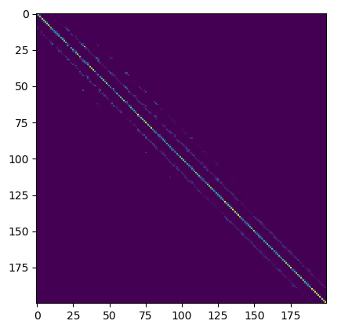
*Transition matrix. Rows and columns are flattened histogram of a grid 20 cells high and 10 cells wide. Spatially adjacent grid cells are visible at a spacing of -11, -10, -9, 1, 10, and 11 cells from the diagonal. The intensity of pixels in the diagonal represents relative likelihood to stay in the same position.*

__Hierarchical Agglomerative Clustering__

Clustering spatial trajectories has broad applications. 
For mice, hierarchical agglomerative clustering can be used to identify similarities between groups, for example
periodic activity and location visit frequency.
Clustering actograms is possible with `df.traja.plot_cluster()` and is demonstrated in [Fortasyn Paper].

### Graph Model

A graph is $G(V,E)$ where $V$ and $E$ are edges and vertices.
A probabilistic graphical model of a spatial occupancy grid can be used to identify probabilities of state transitions between nodes.

[Insert graph-based methods of Traja]

### Convex Hull

The convex hull of a subtrajectory is the set $X$ of points in the Euclidean plane that is the smallest convex set to include $X$.
For computational efficiency, a geometric $k$-simplex 

[WIP]:: $\sigma = \[v_0,...,v_k\] \in \mathbb{R}^2$ is ...

[Insert convex hull method of Traja]

# References

[^1]: Nicolas Limare \url{http://nicolas.limare.net/pro/notes/2014/12/12_arit_speed/} notes that a 65\% speed-up is observed by reducing precision from pandas default double-precision (64-bytes) to single-precision (32-bytes).}

[^2]: In this experiment, for example, data can be reduced from single-precision floating point (32 bits) to byteint (8 bits) format}