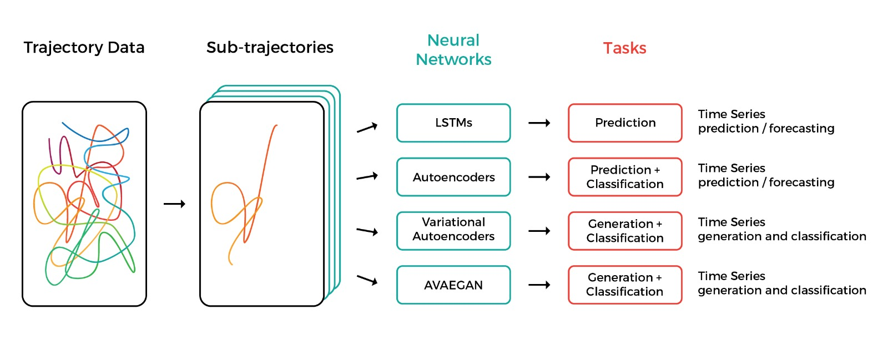

# Summary

There are generally four categories of trajectory data: mobility of people, mobility of transportation vehicles, mobility of animals, and mobility of natural phenomena [@zheng-trajectory-2015]. The examples in this paper focus on animal motion, however it is useful for other domains.

Animal tracking is important for fields as diverse as ethology, optimal foraging theory, and neuroscience. In recent years, advances in machinelearning have led to breakthroughs in pattern recognition and data modeling [@10.3389/fnsys.2019.00020]. A tool that supports modeling in the language of state-of-the-art predictive models  [@amirian_social_2019; @liang_peeking_2019; @chandra_traphic_2019], and which provides researchers with a high-level API for feature extraction, modeling and visualization is needed.

Traja is a Python package for statistical analysis and computational modelling of trajectories. Traja extends the familiar pandas [@mckinney-proc-scipy-2010;@reback2020pandas] methods by providing a pandas accessor to the `df.traja` namespace upon import. The API for Traja was designed to provide an object-oriented and user-friendly interface to common methods in analysis and visualization of animal trajectories. Traja also interfaces well with relevant spatial analysis packages in R (e.g., trajr [@trajr], adehabitat [@adehabitat]), Shapely [@shapely], and MovingPandas [@graser_movingpandas_2019] allowing rapid prototyping and comparison of relevant methods in Python.

The library can be installed to the local Python environment by use of
the provided setuptools script (`setup.py`). It can also be downloaded from the [Python Package Index](http://pypi.org) by use of the package manager pip:
```
pip install traja
```
or with the conda package manager using the `conda-forge` channel:
```
conda install -c conda-forge traja
```

A comprehensive source of documentation is provided on the home page
([http://traja.readthedocs.io](traja.readthedocs.io)).

## Statement of Need

The data used in this project includes animal trajectory data provided by Tecniplast S.p.A.[^1], manufacturer of laboratory animal equipment based in Varese, Italy, and Radboud University, Nijmegen, Netherlands. Tecniplast provided the mouse locomotion data collected with their Digital Ventilated Cages (DVC). The extracted coordinates of the mice requires further analysis with external tools. Due to lack of access to equipment, mouse home cage data is rather difficult to collect and analyze, thus few studies have been done onhomecage data. Furthermore, researchers who are interested in developing novel algorithms must implement from scratch much of the computational and algorithmic infrastructure for analysis and visualization. By packaging a library that is particularly useful for animal locomotion analysis, future researchers can benefit from access to a high-level interface and clearly documented methods for their work.

[^1]: [http://www.tecniplast.it](http://www.tecniplast.it) 

## Design Principles

Traja targets Python because of its popularity with data scientists.The library leverages the powerful pandas library, while adding methods specifically for trajectory analysis.

When importing `traja`, the traja namespace registers itself within the pandas dataframes namespace via `df.traja`.

This lets traja work directly with panda's internal objects:

```
 >>> df = pd.DataFrame({'x':[0,1,2], 'y':[2,3,4]})
 >>> df.traja.center
 (1.0, 3.0)
 >>> df.traja.plot()
```

Data, e.g., x and y coordinates, are stored as one-dimensional labelled arrays as instances of the pandas native `Series` class. Further, subclassing the pandas `DataFrame` allows creating an API that mirrors the pandas API which is familiar to most data scientists, thus reducing the barrier for entry while providing methods and properties specific to trajectories for rapid prototyping.

## Mouse Locomotion Data

The data samples presented throughout this paper[^2] are in rectangular (x, y) Cartesian coordinates, reflecting the mouse home-cage (25x12.5 cm) dimensions. Analytical methods relevant to 2D rectilinear analysis of highly constrained spatial coordinates are thus primarily considered.

{width=80%} 

High volume data like animal trajectories has an increased tendency to be missing data due to data collection issues or noise. Filling in the missing data values, referred to as _data imputation_, is achieved with a wide variety of statistical or learning-based methods. As previously observed, data science projects typically require at least _95%_ of the time to be spent on cleaning, pre-processing and managing the data [@bosch_engineering_2021]. Therefore, several methods relevant to preprocessing animal data are demonstrated throuhghout the following sections.

[^2]: This dataset has been collected for other studies of our laboratory [@shenk_automated_2020].

## Overview of the Library

The software is structured into several modules. This section surveys the structure of the codebase and elaborates on implementation strategies, but does not constitute a full documentation. For a detailed API reference, the reader is referred to the HTML documentation[^3]. The import classes are the `TrajaDataFrame` class located in `frame.py` and `TrajaAccessor` located in `accessor.py`. The root package diagram is shown in Figure 1.

[^3]: [https://traja.readthedocs.io](https://traja.readthedocs.io)

A high-level accessor (`TrajaAccessor`) provides access to data stored within the pandas dataframe, as well as methods within `trajectory` and `plotting` modules:

``` {.python language="Python"}
import pandas as pd
...
@pd.api.extensions.register_dataframe_accessor("traja")
class TrajaAccessor(object):
    """Accessor for pandas DataFrame with trajectory-specific numerical and analytical functions.
    Access with `df.traja`.
    """
    def __init__(self, pandas_obj):
        self._validate(pandas_obj)
        self._obj = pandas_obj
    ...
```

Additionally `TrajaDataFrame` is a subclass of the pandas `DataFrame`, allowing instantiation of a `TrajaDataFrame` directly from an array of x,y coordinates:

``` {language="python"}
import numpy as np
xy = np.array([[0,1,2],[1,2,3]])
df = traja.TrajaDataFrame.from_xy(xy)
```

### The `trajectory` module

The `trajectory` module contains the methods relevant to preprocessing, analysis and modelling trajectories. A complete table of methods included as of writing are described in Table 1.

__Table 1 `traja.trajectory` functionalities__

|Name|Function|
|----------------------|-------------------------------------------------|
  angles                | Returns angles w.r.t. x-axis
  calc_derivatives      |Computes the step displacement $\frac{ds}{dt}$ and displacement time
  calc_displacement     |Computes the displacement $\frac{ds}{dt}$ between consecutive indices
  calc_heading          |Computes the direction of travel for each step
  calc_laterality       |Compute number of right and left turns
  calc_turn_angle      |Computes the turn angle `theta` between time steps
  calc_flow_angles     |Computes the average flow between grid indices
  cartesian_to_polar   |Converts x,y coordinates to polar coordinates $\gamma$ and $\theta$
  coords_to_flow       |Computes the average flow between grid indices
  distance_between      |Computes distance between trajectories with Hausdorff or dynamic time warping methods
  distance               |Computes the distance from start to end of trajectory, also called net distance, displacement, or bee-line from start to finish
  generate               |Generate random walk with normally distributed step lengths and turn angles
  get_derivatives       |Computes the first and second-order derivatives of position
  grid_coordinates      |Bin trajectory into grid coordinates
  length                 |Computes the cumulative length of trajectory
  polar_to_z           |Converts polar coordinates $\gamma$ and $\theta$ to complex number $Z$
  rediscretize_points   |Computes rediscretized points with given step length
  resample_time     | Resamples time by given `step_time`
  rotate                 |Rotate trajectory `angle` degrees in radians about `origin`
  smooth_sg             |Smooth trajectory with Savitzky-Golay filtering
  speed_intervals       |Computes intervals where speed is faster or slow than given parameters
  step_lengths          |Calculate step length
  to_shapely            |Convert to `Shapely` object
  transition_matrix     |Computes the transition matrix from binned trajectory
  transitions           | Computes the first-order Markov model for transitions between grid cells
  
### The `plotting` module

The `plotting` module contains all methods relevant to visualization of trajectories, features and models. A complete table of methods included as of writing are described in Table 

__Table 2 `traja.plotting` functionalities__

|Name|Function|
|---------------------------------|-------------------------------------------------------------|
  animate|                      Animate trajectory
  bar_plot|                    Create bar plot
  color_dark|                  Color dark periods (nighttime)
  fill_ci    |                 Fill confidence intervals
  find_runs   |                Find runs of consecutive times in an array
  plot         |                Generic plotting method
  plot_3d       |              Plot 3D
  plot_actogram  |             Plot actogram showing activity as spikes
  plot_autocorrelation|        Plot autocorrelation of coordinate (Figure 7)
  plot_collection      |       Plot mulitple trajectories
  plot_contour          |      Plot contour map
  plot_clustermap        |     Plot clusterred actograms using hierarchical agglomerative clustering
  plot_{flow,quiver,stream,surface}           |Plot flow between grid coordinates
  plot_periodogram            |Plot power spectrum (Figure 8)
  plot_transition_graph     | Plot transition graph between grid coordinates
  plot_transition_matrix    | Plot transition matrix (paragraph 2.1.11)
  polar_bar                  |Plot polar bar chart with step lengths and turn angles
  plot_prediction                | Plot and visualize neural network prediction of trajectory (subsubsection 2.1.11)
  trip_grid                   |Plot trip grid as heatmap (Figure 3)


### The `rutils` module

The `rutils` module[^4] contains all methods relevant to interfacing R packages. It includes interfaces for:
-   moveHMM
-   adehabitat
-   trajr
as well as respective plotting methods.

[^4]: rutils available in version 0.2 - 0.2.3 and is removed in version 0.2.4 

__Table 3 R packages with interfaces in Traja__

 | R Package     | Description|
 | --------------| --------------------------------------------------------|
  adehabitat     |A collection of tools for the analysis of habitat selection by animals.
  moveHMM        |An R package for the analysis of animal movement data
  trajr          |A toolkit for the numerical characterisation and analysis of the trajectories of moving animals

## Documentation

The entire codebase is liberally documented using the Sphinx documentation processor[^5]. The documentation contains further documentation with a detailed user guide and installation instructions. At the time of writing, the HTML documentation and API reference is hosted at <https://traja.readthedocs.io>.
[^5]: [http://www.sphinx-doc.org](http://www.sphinx-doc.org)

## Spatial Trajectory

A *spatial trajectory* is a trace generated by a moving object in geographical space. Trajectories are traditionally modelled as a sequence of spatial points like:

$$T_k = \{P_{k1}, P_{k2},...\}$$

where $P_{ki}(i\geq 1)$ is a point in the trajectory.

Generating spatial trajectory data via a random walk is possible by sampling from a distribution of angles and step sizes [@kareiva_analyzing_1983,@mclean_trajr:_2018]. A correlated random walk (Figure 4) is generated with:
```
from traja import generate
generate(n=1000) #1000 steps
```

## Spatial Transformations
Transformation of trajectories can be useful for comparing trajectories from various geospatial coordinates, data compression, or simply for visualization purposes.

**Rotation** Rotation of a 2D rectilinear trajectory is a coordinate transformation of orthonormal bases x and y at angle $\theta$ (in radians) around the origin defined by

$$\begin{bmatrix} x'//y' \end{bmatrix} = \begin{bmatrix} cos\theta & i sin\theta\\ sin\theta & cos\theta \end{bmatrix} \begin{bmatrix} x\\y \end{bmatrix} $$

This is achieved with a clockwise angle of 20 degrees, for example, by

```
df.traja.rotate(angle=-20)
```
and angle $\theta$ where $\theta \in R : \theta \in [-180,180]$.

### Trip Grid 
One strategy for compressing the representation of trajectories is binning the coordinates to produce an image as shown in Figure [\[fig:tripgrid\]](#fig:tripgrid){reference-type="ref" reference="fig:tripgrid"}.

{width=80%} 

[\[fig:tripgrid_gen\]]{#fig:tripgrid_gen label="fig:tripgrid_gen"}

Allowing computation on discrete variables rather than continuous ones has several advantages stemming from the ability to store trajectories in a more memory efficient form [^6]. The advantage is that computation is generally faster, more data can fit in memory in the case of complex models, and item noise can be reduced.

[^6]: In this experiment, for example, data can be reduced from single-precision floating point (32 bits) to byteint (8 bits) format.

Creation of an $M * N$ grid allows mapping trajectory $T_k$ onto uniform
grid cells. Generalizing the nomenclature of [@wang_modeling_2017] to rectangular grids, $C_{mn}(1\leq{m}\leq M; 1\leq{n}\leq{N})$ denotes the cell in row $m$ and column $n$ of the grid. Each point $P_{ki}$ is assigned to a cell $C(m,n)$. The result is a two-dimensional image $M*N$ image $I_k$, where the value of pixel $I_k(m,n)(1\leq{m,n}\leq{M})$ indicates the relative number of points assigned to cell $C_{mn}$. Partionining of spatial position into separate grid cells is typically preceded by generation of hidden Markov models [@jeung_mining_2007] (see below).

![Visualization of heat map from bins generated with `df.trip_grid`. Note regularly spaced artifacts (bright yellow) in this sample due to a bias in the sensor data interpolation. This type of noise can be minimized by thresholding or using a logarithmic scale (`traja.trip_grid(trj, log=True)`, as shown above.[]{label="fig:tripgrid"}](./images/tripgrid.png){#fig:tripgrid width=80%}

### Feature Scaling

Feature scaling is common practice for preprocessing data for machine learning [@grus_data_2015] and is essential for even application of methods to attributes. For example, a high dimensional feature vector $\mathbf{x} \in \mathbb{R}^n$ where some attributes are in $(0,100)$ and others are in $(-1,1)$ would lead to biases in the treatment of certain attributes. To limit the dynamic range for multiple data instances simultaneously, scaling is applied to a feature matrix $X = \{\mathbf{x_1}, \mathbf{x_2}, ..., \mathbf{x_N}\} \in \mathbb{R}^{n\times{N}}$, where $n$ is the number of instances.

![Generation of a random walk[]{label="fig:generated"}](./images/generate.png){#fig:generated width="\textwidth"}

### Min-Max Scaling

To guarantee that the algorithm applies equally to all attributes, the normalized feature matrix $\hat{X}$ is rescaled into range $(0,1)$ such that

$\hat{X} = \frac{X - X_{min}}{X_{max} - X_{min}}$

### Standardization

The result of standardization (or Z-score normalization) is that the features will be rescaled to have the property of a standard normal distribution with $\mu = 0$ and $\sigma = 1$ where $\mu$ is the mean (average) of the data and $\sigma$ is the standard deviation from the mean. Standard scores (also known as **z**-scores are calculated as follows:

$z = \frac{x-\mu}{\sigma}$

### Scale

Scaling a trajectory is performed with
```
df.traja.scale(factor)
```
for factor f where $f \in R: f \in (-\infty, +\infty)$. 

### Smoothing 

Smoothing can also be achieved with traja using Savitzky-Golay filtering with `smooth_sg` [@savitzky_smoothing_1964].

## Temporal Transformations

### Resampling 

Trajectories can be resampled by time or by step length. This can be useful for aligning trajectories from various data sources and sampling rates or reducing the number of data points to improve computational efficiency. Care must be taken to select a time interval which maintains information on the significant behavior. If the minimal time interval observed is selected for the points, calculations will be computationally intractable for some systems. If too large of an interval is selected, we will fail to capture changes relevant to the target behavior in the data.

Resampling by time is performed with `resample_time`. Rediscretizing by step length is performed with `rediscretize` (Figure [\[fig:step\]](#fig:step){reference-type="ref" reference="fig:step"}).

![Resampling x and y values over time by step length is performed with `rediscretize()`.[]{label="fig:step"}](./images/sample_rate.png){#fig:step width=80%}

For example, Fortasyn dataset [@shenk_automated_2020] which is demonstrated in this paper was sampled at 4 Hz and converted to single-precision floating point data. Pandas dataframes store this data in 4 bytes, thus there are approximately 4,147,200[^7] bytes required to store data for x and y dimensions plus an index reference for a single day. In the case of [@shenk_automated_2020] were 24 mice observed over 35 days. This translates to 3.4 GB ($10^9$) to 29 TB ($10^{12}$) of storage capacity respectively, for the uncompressed datasets prior to feature engineering. Thus resampling can be a useful way to reduce the memory footprint for memory constrained processes that have to fit into a standard laptop with 8 GB memory space. A demonstration of how resampling can reduce precision but still be useful for trajectory data analysis is provided in Figure 5, applied to a sample from the Fortasyn experiment [@shenk_automated_2020]. For identifying broad effects such as cage crossings, for example, data can be downsampled to a lower frequency such as 0.1 Hz, reducing the memory footprint by a factor of 40 (4 Hz/0.1 Hz) and providing significant speedups for processing.

## Movement Analysis
### Distance traveled 
Distance traveled is a common metric in animal studies - it accounts for the total distance covered by the animal within a given time interval. The distance traveled is typically quantified by summing the square straight-line displacement between discretely sampled trajectories [@rowcliffe_bias_2012, @solla_eliminating_1999]. Alternative distance metrics for the case of animal tracking are discussed in [@noonan_scale-insensitive_2019].

Let $p(t) = [p_x(t), p_y(t)]$ be a $2\times 1$ vector of coordinates on the ground representing the position of the animal at time t. Then, the distance traveled within the time interval $t_1$ and $t_2$ can be computed as a sum of step-wise Euclidean distances

$$p(t_1,t_2) = \Sigma^{t_2}_{t=t_1+1} d(t),$$ 

where
$$d(t) = \sqrt{(p_x(t) -p_x(t-1))^2 + (p_y(t) - p_y(t-1))^2}  $$ 

is the Euclidean distance between two positions in adjacent time samples.

[^7]: 4 x 4 Hz x 60 seconds x 60 minutes x 24 hours x 3 features (x,y, and time)

![Velocity histogram from one day of mouse activity.[]{label="fig:velocity-hist"}](./images/velocitylog.png){#fig:velocity-hist width=70%}

### Speed 
Speed or velocity is the first derivative of centroids with respect to time. Peak velocity in a home cage environment is perhaps less interesting than a distribution of velocity observations, as in Figure 6. Additionally, noise can be eliminated from velocity calculations by using a minimal distance moved threshold, as demonstrated in [@shenk_automated_2020]. This allows identifying broad-scale behaviors such as cage crossings.

### Turn Angles
Turn angles are the angle between the movement vectors of two consecutive samples. They can be calculated with calc_turn_angles.

### Laterality 
Laterality is the preference for left or right turning and a *laterality index*
is defined as:
$$LI = \frac{RT}{LT + RT} $$ 

where RT is the number of right turns observed and LT is the number of left turns observed. Turns are counted within a left turn angle $\in$ ($\theta$, 90) and right turn angle $\in(-\theta,-90)$. A turn is considered to have a minimal step length. In Traja it is computed with

```python
calc_laterality(trj, dist_thresh, angle_thresh)
```

and returns a 2-tuple of the number of right and left turns.

## Advanced Techniques
### Periodic Analysis
Periodic behaviors are a consequence of the circadian rhythm aswell as observing expression of underlying cognitive traits. Some basic implementations of periodic analysis of mouse cage data are presented.

### Autocorrelation 
Autocorrelation is the correlation of a signal with a delayed copy of itself as a function of the decay. Basically, it is similarity of observations as a function of the time lag between them. 
It is computed with autocorrelation and plotted with `plot_autocorrelation`, as in Figure 7.

![Autocorrelation of the y-dimension reveals daily (1440 minutes) periodic behavior[]{label="fig:autocorrelation"}](./images/autocorrelation_E1.png){#fig:autocorrelation width=80%}

### Power Spectrum 
Power spectrum of a time-series signal can be estimated with `plot_periodogram` (Figure 8). This is useful for analyzing signals, for example, the influence of neuromotor noise on delays in hand movement [@van_galen_effects_1990].

![Power Spectral Density. One day of activity reveals fairly smooth power spectral density.[]{label="fig:powerspectrum"}](./images/spectrum.png){#fig:powerspectrum width=70%}

## Algorithms and Statistical Models
### Machine Learning for Time Series Data
Machine learning methods enable researchers to solve tasks computationally without explicit instructions by detecting patterns or relying on inference. Thus they are particularly relevant for data exploration of high volume datasets such as spatial trajectories and other multivariate time series.

### Principal Component Analysis
The ability to identify patterns between groups and over time is often constrained by computational resources. Finding representations of the data which allow reducing the dimensionality of the data is thus a valuable preprocessing step in exploratory data analysis as wel as machine learning applications. A common method of reducing the dimensionality of high dimensional data is to identify the directions which explain most of the variance via eigenvector decomposition of the covariance matrix __E__.

![PCA of Fortasyn trajectory data. Daily trajectories (day and night)
were binned into 8x8 grids before applying
PCA.[]{label="fig:pca"}](./images/pca_fortasyn-period.png){#fig:pca
width=80%}

Principal Component Analysis projects the data into a linear subspace with a minimum loss of information by multiplying the data by the eigenvectors of the covariance matrix.

This requires converting the trajectory to a trip grid (see Figure 3) and performing PCA on the grid in 2D (Figure 9) or 3D (Figure 10). Structure in the data is visible if light and dark time periods are compared.

### Linear Discriminant Analysis
Linear Discriminant Analysis (LDA) is a method for identifying a manifold separating two or more labelled groups. It searches for a linear transformation of the data by maximising the between-class variance and minimising the within-class variance. It has been used to identify symmetry of heavy object lifting trajectories [@jeong_linear_2016]. LDA assumes normal distribution of attributes, and identies the probability that a new set of inputs belong to a given class. Since LDA takes into account class labels, and there are only binary labels in the present dataset, it provides an identical view to PCA as shown in Figure 11. When the x, y attributes are not normally distributed, which is often the case, methods such as logistic regression are preferred, since it has fewer assumptions and restrictions [@hastie01statisticallearning].

![3D PCA of Fortasyn trajectory data. Daily trajectories (day and night)
were binned into 8x8 grids before applying
PCA.[]{label="fig:3dpca"}](./images/pca_fortasyn-period-3d.png){#fig:3dpca
width=80%}

![LDA of Fortasyn trajectory
data.[]{label="fig:LDA"}](./images/lda_fortasyn-period.png){#fig:LDA
width=80%}

### Clustering 
Clustering of trajectories is an extensive topic with applications in geospatial data, vehicle and pedestrian classification, as well as molecular identification. K-Means clustering is an iterative unsupervised learning method that assigns a label to data points based on a distance function [@bishop_pattern_2006].
Clustering of trajectories is achieved with by first extracting displacements with
```
traja.calc_displacements()
```
and wrapping seaborn’s `clustermap`[^8] object:

[^8]: [https://seaborn.pydata.org/generated/seaborn.clustermap.html](https://seaborn.pydata.org/generated/seaborn.clustermap.html)

![K-Means clustering on the results of the PCA shown above reveals a high accuracy
of classification, with a few errors. Cluster labels are generated by
the model.[]{label="fig:kmeans"}](./images/kmeans_pca-fortasyn.png){#fig:kmeans
width=80%}


```python
plot_clustermap(displacements, ...)
```

### Hierarchical Agglomerative Clustering 
Clustering spatial trajectories has broad applications. For mice, hierarchical agglomerative clustering can be used to identify similarities between groups, for example periodic activity and location visit frequency. Clustering actograms is possible with df.traja.plot_cluster.

### Gaussian Processes 
Gaussian Processes is a non-parametric method which can be used to model spatial trajectories. This method is not currently implemented in Traja
and is thus outside the scope of the current paper, however the interested reader is directed to the excellent text on Gaussian processes by Rasmussen and Williams ([@rasmussen_gaussian_2006]) for a complete reference and [@cox_gaussian_2012] for an application to spatial trajectories.

## Other Methods
### Graph Model 
A graph is a pair $G = (V, E)$ comprising a set of vertices and a set of connecting edges. A probabilistic graphical model of a spatial occupancy grid can be used to identify probabilities of state transitions between nodes. A basic example is given with hidden Markov models below.

![Transition matrix. Rows and columns are flattened histogram of a grid
20 cells high and 10 cells wide. Spatially adjacent grid cells are
visible at a spacing of -11, -10, -9, 1, 10, and 11 cells from the
diagonal. The intensity of pixels in the diagonal represents relative
likelihood to stay in the same
position.[]{label="fig:transitionmatrix"}](./images/transition_matrix.png){#fig:transitionmatrix
width=60%} 

### Hidden Markov Models
Transition probabilities are most commonly modelled with Hidden Markov Models (HMM) because of their ability to capture spatial and temporal dependencies. A recent introduction to these methods is available provided by [@patterson_statistical_2017]. HMMs have successfully been used to analyze movement of caribou [@franke_analysis_2004], fruit flies [@holzmann_hidden_2006], and tuna [@patterson_migration_2018], among others. Trajectories are typically modelled as bivariate time series consisting of step length and turn angle, regularly spaced in time. 

Traja implements the rectangular spatial grid version ofHMMwith transitions.

The probability of transition from each cell to another cell is stored as a probability within the transition matrix. This can further be plotted (eg, Figure 13) with `plot_transition_matrix`.

### Convex Hull 
The convex hull of a subtrajectory is the set X of points in the Euclidean plane that is the smallest convex set to include X. For computational efficiency, a geometric k-simplex can be plotted covering the convex hull by converting to a Shapely object and using Shapely’s `convex_hull` method. `plot_rolling_hull` performs this. Plotting the convex hull in 3D allows seeing the change of the range of motion over time via `plot_rolling_hull_3d`.

### Recurrent Neural Networks
In recent years, deep learning has transformed the field of machine learning. For example, the current state of the art models for a wide range of tasks, including computer vision, speech to text, and pedestrian trajectory prediction, are achieved with deep neural networks. Neural networks are essentially sequences of matrix operations and elementwise function application based on a collection of computing units known as nodes or neurons 1.3. These units perform operations, such as matrix multiplication on input features of a dataset, followed by backpropagation of errors, to identify parameters useful for approximating a function.

{width=80%} 

Recurrent Neural Networks (RNNs) are a special type of Neural Networks that use
a state $S(`t_{i-1}`)$ from the previous timestep $`t_{i-1}`$ alongside X(`$t_i$`) as input. They output a prediction $Y(`t_i`)$ and a new state $`S(t_i)`$ at every step. Utilising previous states makes RNNs particularly good at analyzing time series like trajectories, since they can process arbitrarily long inputs. They remember information from previous time steps $X(`t_{i-k}`), ..., X(`t_{i-1}`)$ when processing the current time step $X(`t_i`)$.

Trajectory prediction lets researchers forecast the location and trajectory of animals. Where this technique works well, it is also a sign that the trajectory is highly regular and, fundamentally, follows certain rules and patterns. When tracking an animal live, it would also let researchers predict when it will arrive at a particular location, or where it will go, letting them rig cameras and other equipment ahead of time.

A particularly interesting type of RNN is the Long Short Term Memory (LSTM) architecture. Their layers use stacks of units, each with two hidden variables - one that quickly discards old states and one that slowly does so - to consider relevant information from previous time steps. They can thus look at a trajectory and determine a property of the animal – whether it is sick or injured, say – something that is time-consuming and difficult to do by hand. They can also predict future time steps based on past ones, letting researchers estimate where the animal will go next. LSTMs can also classify trajectories, determining whether a trajectory comes from an animal belonging in a specific category. This lets researchers determine how a controlled or semi-controlled variable (e.g., pregnancy) changes the movement pattern of an animal.

Traja implements neural networks by extending the widely used open source machine learning library PyTorch, primarily developed by Facebook AI Research Group. Traja allows framework-agnostic modeling through data loaders designed for time series. In addition, the Traja package comes with several predefined model architectures which can be configured according to the user’s requirements.

Because RNNs work with time series, the trajectories require special handling. The `traja.dataset.MultiModalDataLoader` efficiently groups subsequent samples and into series and splits these series into training and test data. It represents a Python iterable over the dataset and extends the PyTorch `DataLoader` class, with support for
• random, weighted sampling,
• data scaling,
• data shuffling,
• train/validation/test split.

`MultiModalDataLoader` accepts several important configuration parameters and
allows batched sampling of the data. The two constructor arguments `n_past` and
`n_future` specify the number of samples that the network will be shown and the number that the network will have to guess, respectively. `batch_size` is generally in the dozens and is used to regularise the network. The `MultiModalDataLoader` has a signature:

```python
MultiModalDataLoader(df,
    batch_size=10, # number of sequences to train every step
    n_past=10, # number of time steps to learn the time series  
    n_future=5, # number of time steps to predict
    split_by_id=True) # whether to split data by trajectory id or
        by time steps for each id
```

A sample implementation of LSTM for trajectory forecasting is as follows:

```python
from traja.models.predictive_models.lstm import LSTM

# more LSTM layers learn more complex patterns but risk overfitting
num_layers = 2
# wider layers learn more complex patterns but risk overfitting
hidden_size = 32
# ignore some network connections (improves generalization)
dropout = 0.1
model = LSTM(input_size=input_size,
        hidden_size=hidden_size,
        num_layers=num_layers,
        output_size=output_size,
        dropout=dropout,
        batch_size=batch_size,
```

The RNNs also need to be trained - this is done by the high-level Trainer class below. It performs nonlinear optimisation with a Stochastic Gradient Descent-like algorithm. The Trainer class by default implements the Huber loss function [@huber_robust_1964], also known as smooth $L_1$ loss, which is a loss function commonly used in robust regression:

$$L_{\delta} (a) = \begin{cases}
 \frac{1}{2}{a^2}                   & \text{for } |a| \le \delta, \\
 \delta (|a| - \frac{1}{2}\delta), & \text{otherwise.}
\end{cases}$$

In comparison to mean-squared error loss, Huber loss is less sensitive to outliers in data: it is quadratic for small values of a, and linear for large values. It extends the PyTorch SmoothL1Loss class, where the d parameter is set to 1[^9]. Acommon optimization algorithm is ADAM and is Traja’s default, but several others are provided as well. Although training with only a CPU is possible, a GPU can provide a $40-100x$ speedup [@Arpteg2018SoftwareEC].
[^9]: [https://pytorch.org/docs/stable/generated/torch.nn.SmoothL1Loss.html](https://pytorch.org/docs/stable/generated/torch.nn.SmoothL1Loss.html)

### Recurrent Autoencoder Networks
Traja can also train autoencoders to either predict the future position of a track or classify the track into a number of categories. Autoencoders embed the time series into a time-invariant latent space, allowing representation of each trajectory or sub-trajectory as a vector (Figure 15). A class of well-separated trajectories would then be restricted

![Example of how autoencoders compress data such as an image to an embedding vector. Source: Author’s Towards Data Science post [@shenk_towards_2020].](./images/trip_grid_algo.png){width=80%} 

A sample implementation of high-level API for training neural networks for time-series data, including autoencoders, variational autoencoder, and LSTMs is:

```python
from traja.models.train import HybridTrainer
optimizer_type = 'Adam' # Nonlinear optimiser with momentum
loss_type = 'huber'

# Trainer
trainer = HybridTrainer(model=model,
    optimizer_type=optimizer_type,
    loss_type=loss_type)

# Train the model to forecast the trajectory
trainer.fit(data_loaders,
    model_save_path,
    epochs=10,
    training_mode='forecasting')
```

to a region of the latent space. The technique is similar to Word2vec [@word2vec], where words are converted to a 100+ dimensional vector. In this approach, forecasting and classification are both preceded by training the data in an autoencoder, which learns an efficient representation of the data for further computation of the target function.

![LSTM implementation for trajectory
prediction[]{label="fig:lstm"}](./images/rnn-prediction.png){#fig:lstm
width=80%}
 
Traja can train a classifier that works directly on the latent space output; since each class of trajectories converges to a distinct region in the latent space, this technique is often superior to classifying the trajectory itself. Traja trains classifiers for both Autoencoderstyle and Variational Autoencoder-style RNNs. When investigating whether animals’ behaviors have changed, or whether two experimental categories of animals behave differently, this unstructured data mining can suggest fruitful avenues for investigation.

A sample usage of multimodal autoencoder combining training for both forecasting and classification tasks follows:

```python
from traja.models.generative_models.ae import MultiModelAE
from traja.models.train import HybridTrainer

# Because we will also train a classifier,
# we need to provide extra parameters.
num_classifier_layers=4,
classifier_hidden_size=32,
num_classes=9

model = MultiModelAE(input_size=2,
    num_past=num_past,
    batch_size=batch_size,
    num_future=num_future,
    lstm_hidden_size=32,
    num_lstm_layers=2,
    output_size=2,
    latent_size=10,
    batch_first=True,
    dropout=0.1,
    reset_state=True,
    bidirectional=False,
    num_classifier_layers=num_classifier_layers,
    classifier_hidden_size=classifier_hidden_size,
    num_classes=num_classes)

optimizer_type = 'Adam' # Nonlinear optimiser with momentum
loss_type = 'huber'

# Trainer
trainer = HybridTrainer(model=model,
    optimizer_type=optimizer_type,
    loss_type=loss_type)

# Train the model to forecast the trajectory, so we have a valid
# latent space
trainer.fit(data_loaders,
    model_save_path,
    epochs=10,
    training_mode='forecasting')
# Now optimise the classification head
trainer.fit(data_loaders,
    model_save_path,
    epochs=10,
    training_mode='classification')
```

# References